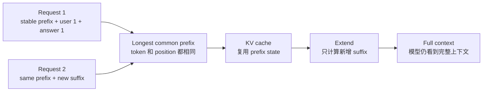

# Prompt Cache 的价值与原理：少算重复前缀，降低成本和延迟

<p class="article-meta">发布于 2026-07-07</p>

> 缓存不是让模型少看上下文，而是让推理系统少做重复的前缀计算。

Agent 时代的 LLM 请求越来越长：system prompt、工具定义、项目规则、历史消息、tool result、文件片段和命令输出会在多轮请求之间反复出现。Prompt Cache 要回答的问题是：既然前面大段 token 完全相同，推理系统能不能复用已经算过的内部状态，而不是每轮都重新 prefill？

本文先说明 Prompt Cache 的现实价值：它如何降低 token 计费成本和请求延迟。随后再从缓存成立的基本条件出发，依次定义 token、position、prefix、suffix 和 LCP，推导自回归生成、attention、KV Cache、前缀不变性和成本模型，最后说明推理引擎如何把这个性质工程化。vLLM 和 SGLang 都是代表性的 LLM 推理引擎，本文后半部分以 SGLang 的 RadixAttention 和 HiCache 为例。



_图：相同 token 前缀命中缓存后，推理系统复用已有 KV state，只计算新增 suffix。_

## 1. Prompt Cache 的价值：成本下降和延迟下降

Prompt Cache 的价值可以从两个维度看：token 计费成本和请求延迟。

在成本上，Prompt Cache 把一部分重复输入 token 从“缓存未命中输入”变成“缓存命中输入”。不同服务商的计费方式不同，但如果服务商对 cache hit input token 单独定价，收益会非常直观。

以 [DeepSeek API 模型价格](https://api-docs.deepseek.com/zh-cn/quick_start/pricing) 在 2026-07-07 访问到的价格为例，输入 token 价格按“百万 tokens”计费，并区分缓存命中和缓存未命中：

| 模型 | 输入缓存命中 | 输入缓存未命中 | 输出 |
| --- | ---: | ---: | ---: |
| deepseek-v4-flash | 0.02 元 / 百万 tokens | 1 元 / 百万 tokens | 2 元 / 百万 tokens |
| deepseek-v4-pro | 0.025 元 / 百万 tokens | 3 元 / 百万 tokens | 6 元 / 百万 tokens |

这个价格结构说明了 Prompt Cache 的经济价值：对 deepseek-v4-flash，缓存命中的输入价格是未命中的 2%；对 deepseek-v4-pro，缓存命中的输入价格约为未命中的 0.83%。价格可能随服务商策略变化，但这种“cached input 比 uncached input 便宜很多”的结构，正是 Prompt Cache 在长上下文和多轮 Agent 场景中有价值的原因。

假设某个 coding agent 每轮有 100K tokens 的稳定前缀反复出现：

```text
repeated prefix = 100K input tokens
```

如果这些 token 在 deepseek-v4-flash 上未命中缓存，输入成本约为：

$$
0.1 \times 1 = 0.1 \text{ 元}
$$

如果命中缓存，输入成本约为：

$$
0.1 \times 0.02 = 0.002 \text{ 元}
$$

这里的 $0.1$ 表示 100K tokens 等于 0.1 百万 tokens。单轮看差额不大，但 Agent 的特点是高频、多轮、长上下文；当同一类长前缀在大量请求中反复出现时，cache hit 会直接影响整体推理成本。

在延迟上，Prompt Cache 主要降低 time to first token。长 prompt 的第一步通常要经过 prefill：模型需要处理完整输入，并生成所有输入 token 的 KV state。如果前缀命中缓存，系统可以跳过重复前缀的 prefill，只对新增 suffix 做 extend。

因此，Prompt Cache 对延迟的收益可以概括为：

```text
更少重复 prefill
-> 更低 TTFT
-> 多轮 Agent 交互更接近连续响应
```

这并不意味着所有请求都会无条件变快。真实收益仍然取决于前缀长度、命中率、KV 所在层级、fetch 成本、batching 和调度策略。如果 KV 已经在 GPU 上，取回成本低，延迟收益通常更直接；如果 KV 在 CPU、磁盘或远端存储，系统就需要 prefetch、I/O overlap 和 cache-aware scheduling 来避免取回成本抵消计算收益。

Prompt Cache 的核心定义是：

> Prompt Cache 不是缓存回答，而是缓存相同 prompt 前缀在模型内部算出来的 KV state，让下一次请求只计算新增部分。

但如果从第一性原理出发，我们不应该一开始就接受这个结论。我们要先问一个更基本的问题：**任何缓存为什么可以成立？**

答案来自缓存的基本条件：

> 同一个确定性函数，在相同输入下，会产生相同输出。缓存就是把这个输出保存下来，下次遇到相同输入时直接复用。

在本文中，可以把缓存条件直接写成推理系统里的关系：

$$
\text{相同计算过程}+\text{相同输入}
\Rightarrow
\text{相同内部状态}
$$

Prompt Cache 要证明的正是：在相同模型和相同推理配置下，相同 token 前缀会产生相同的内部 KV state。缓存的正确性来自这个不变性。

Prompt Cache 只是把这件事放进 LLM 推理里：

```text
确定性计算
-> 相同 token 前缀
-> 相同位置和模型配置
-> 相同 KV state
-> 可以跨请求复用
```

本文会从最基本的定义出发，一步步推到这个结论。目标读者是有基本编程常识、但不默认懂 Transformer 的读者。你不需要先知道 KV Cache 是什么；我们会从 token、position、自回归生成和 attention 开始推。

## 2. 基本定义：模型真正处理的是什么

LLM 不直接处理原始字符串，而是先把文本切成 token 序列。

设原始文本是：

$$
\mathrm{text}
$$

tokenizer 会把它变成：

$$
\mathrm{tokens}(\mathrm{text})=(x_1,x_2,\ldots,x_n)
$$

模型实际接收的不是字符串本身，而是一串 token id。一个中文词、英文单词片段、标点、空格，都可能对应一个或多个 token。

每个 token 还有自己的位置编号：

$$
\mathrm{pos}(x_i)=i
$$

位置会参与模型计算。同一段文本如果出现在不同位置，它在模型内部产生的状态通常也不同。

接下来定义几个本文反复使用的概念。

| 概念 | 定义 |
| --- | --- |
| prompt | 输入给模型的 token 序列，记作 $X=(x_1,\ldots,x_n)$。 |
| prefix | prompt 的前一段，记作 $P=X[1:p]=(x_1,\ldots,x_p)$。 |
| suffix | prompt 中 prefix 后面的部分，记作 $S=X[p+1:n]$。 |
| LCP | longest common prefix，两个 token 序列从开头开始完全相同的最长部分。 |
| position | token 在序列中的位置编号，常见位置编码和 RoPE 都依赖它。 |

因此，本文说“相同前缀”，指的是：

```text
token 序列从第 1 个 token 开始完全相同，并且位置也相同。
```

不是原始字符串看起来差不多，也不是语义相似。

## 3. 贯穿全文的例子：Coding Agent 的多轮请求

以 coding agent 为例，一次模型请求通常不只有用户最新的问题，还会包含 system prompt、工具定义、项目规则、历史消息、tool result、文件片段、命令输出等上下文。

多轮交互大概长这样：

```text
第 1 轮: system + tools + user_1
第 2 轮: system + tools + user_1 + assistant_1 + user_2
第 3 轮: system + tools + user_1 + assistant_1 + user_2 + assistant_2 + user_3
```

把每一轮都看成一个 token 序列：

```text
X_1 = [system][tools][user_1]
X_2 = [system][tools][user_1][assistant_1][user_2]
X_3 = [system][tools][user_1][assistant_1][user_2][assistant_2][user_3]
```

那么：

- $X_1$ 和 $X_2$ 的 LCP 是 `[system][tools][user_1]`。
- $X_2$ 和 $X_3$ 的 LCP 是 `[system][tools][user_1][assistant_1][user_2]`。
- 第 2 轮相对第 1 轮的 suffix 是 `[assistant_1][user_2]`。
- 第 3 轮相对第 2 轮的 suffix 是 `[assistant_2][user_3]`。

Prompt Cache 的目标是：如果前缀已经在上一轮算过，下一轮就复用这个前缀的内部状态，只计算新增 suffix。

但要证明这件事正确，我们需要先理解 LLM 推理到底在算什么。

## 4. 自回归生成：为什么模型必须依赖前文

LLM 生成文本时，不是一次性生成完整答案，而是一个 token 一个 token 地生成。

给定 prompt：

$$
P=(x_1,x_2,\ldots,x_n)
$$

模型要继续生成：

$$
Y=(y_1,y_2,\ldots,y_m)
$$

自回归语言模型把这个过程写成：

$$
p(Y \mid P)=\prod_{t=1}^{m}p(y_t \mid P,y_{<t})
$$

该公式表示：生成第 $t$ 个输出 token 时，模型必须基于完整 prompt 和此前已经生成的所有 token 来判断下一个 token 应该是什么。

把 prompt 和已经生成的 token 合在一起，记作当前上下文：

$$
Z_t=(z_1,z_2,\ldots,z_t)
$$

模型下一步要计算的是：

$$
p(z_{t+1}\mid Z_t)
$$

这就解释了为什么模型不能只看最新用户输入。回到 coding agent 的第 3 轮，模型生成回答时需要基于：

```text
system + tools + user_1 + assistant_1 + user_2 + assistant_2 + user_3
```

Prompt Cache 不能让模型少看这些上下文。它只能让模型不用重新计算已经处理过的前缀。

## 5. Attention 的最小机制：为什么会有 Q/K/V

现在看一层 causal self-attention。你不需要掌握完整 Transformer，只需要知道每个 token 在每一层都会产生三类向量：

- Query：当前 token 想查什么。
- Key：某个历史 token 可以如何被匹配。
- Value：这个历史 token 真正提供的信息。

第 $l$ 层里，第 $i$ 个 token 的上一层 hidden state 是 $h_i^{l-1}$。模型通过三个权重矩阵得到：

$$
\begin{aligned}
q_i^l &= h_i^{l-1}W_Q^l \\
k_i^l &= h_i^{l-1}W_K^l \\
v_i^l &= h_i^{l-1}W_V^l
\end{aligned}
$$

Query、Key、Value 不是额外输入，而是模型从每个 token 的中间表示里算出来的三个视角。

在 causal mask 下，第 $i$ 个位置只能看见 $1,\ldots,i$，不能看见未来 token。它的 attention 输出可以粗略写成：

$$
a_i^l=
\mathrm{softmax}
\left(
\frac{q_i^l(K_{1:i}^l)^\top}{\sqrt{d_k}}
\right)
V_{1:i}^l
$$

这个式子描述的是：当前位置拿自己的 Query 去匹配它能看到的历史 Key，再用匹配权重加权读取历史 Value。

这里出现了 Prompt Cache 的关键线索：未来 token 要理解自己时，需要查询历史 token 的 Key 和 Value。因此，如果历史 token 的 Key/Value 已经算过，就不必每次重新算。

## 6. KV Cache：为什么 K/V 是可复用状态

设当前上下文是：

$$
Z_t=(z_1,z_2,\ldots,z_t)
$$

模型处理完这段上下文后，可以保存每一层的历史 Key/Value：

$$
\mathcal{C}(Z_t)=\{K_{1:t}^l,V_{1:t}^l\}_{l=1}^{L}
$$

KV Cache 保存的是从第 1 个 token 到第 $t$ 个 token，在每一层里算出来的 Key/Value。

为什么这足以支持继续生成？

当新 token $z_{t+1}$ 来的时候，它在每一层都需要读取历史：

$$
K_{1:t+1}^l=[K_{1:t}^l,k_{t+1}^l],\quad
V_{1:t+1}^l=[V_{1:t}^l,v_{t+1}^l]
$$

历史 K/V 可以直接拿来用；模型只需要计算新 token 自己的 $k_{t+1}^l$ 和 $v_{t+1}^l$，然后追加到 cache 里。

所以 KV Cache 不是“记住模型回答了什么”，而是保存“未来 token 做 attention 时必须查询的历史 Key/Value”。

这就是第一次复用：**同一次请求内部，decode 不必每一步都重新计算历史 token。**

## 7. Prefill 和 Decode：一次请求内部的复用

一次 LLM 请求通常分成两个阶段。

第一阶段叫 prefill，也就是先处理输入 prompt：

$$
P=(x_1,\ldots,x_n)
$$

并生成它的 KV Cache：

$$
\mathcal{C}(P)
$$

prefill 阶段会先处理完整输入 prompt，并保存后续生成会用到的历史 K/V。长 prompt 的 time to first token，也就是从请求发出到第一个输出 token 出现的时间，很多时候主要花在 prefill。

第二阶段叫 decode，也就是逐 token 生成输出。第 $t$ 步 decode 使用已有缓存：

$$
\mathcal{C}(P,y_{<t})
$$

然后计算新 token，并把新 token 的 K/V 追加进去：

$$
\mathcal{C}(P,y_{\le t})
=
\mathrm{Append}(\mathcal{C}(P,y_{<t}),K_{y_t},V_{y_t})
$$

普通 KV Cache 已经让同一次请求里的 decode 避免反复重算历史。

但 Agent 场景还有一个更大的重复：不同请求之间，前面的大段 prompt 经常完全一样。Prompt Cache，也叫 Prefix Cache，要把 KV Cache 从“请求内部复用”扩展到“请求之间复用”。

## 8. Prompt Cache：跨请求复用需要什么条件

现在设两个请求：

$$
A=P+S,\quad B=P+T
$$

它们共享同一个前缀 $P$，后缀 $S$ 和 $T$ 可以不同。

Prompt Cache 要复用的是：

$$
\mathcal{C}_A(P)=\mathcal{C}_B(P)
$$

如果两个请求的前缀 $P$ 完全相同，那么第一个请求里算出来的前缀 KV state，第二个请求也可以用。

但这要求下面这些条件一致：

- token 序列一致。
- position ids 或 RoPE 位置编号一致。
- 模型权重一致。
- tokenizer 一致。
- adapter / LoRA / quantization 配置一致。
- attention mask 一致。
- 推理阶段没有会改变前缀中间状态的随机性。

这些条件可以概括为：

> 缓存的是模型内部张量，不是文本字符串。只有内部计算路径一致，KV state 才能被认为是同一个输出。

接下来证明这个复用为什么成立。

## 9. 前缀不变性：一个小定理

**定理：** 对 causal Transformer，如果两个请求共享完全相同的 token 前缀 $P$，并且位置、模型权重和推理配置一致，那么这个前缀在所有层产生的 KV state 相同。

也就是：

$$
A=P+S,\quad B=P+T
\quad\Rightarrow\quad
\mathcal{C}_A(P)=\mathcal{C}_B(P)
$$

这表示：后面接什么，不会改变前面已经算出来的状态。

**Base：第 0 层相同。**

第 0 层来自 token embedding 和位置相关信息：

$$
h_i^0=\mathrm{Embed}(x_i,\mathrm{pos}_i)
$$

如果 $A$ 和 $B$ 的前缀 token 相同，位置也相同，那么对所有 $i\le p$：

$$
h_{A,i}^0=h_{B,i}^0
$$

同一个 token 放在同一个位置，进入模型的初始表示相同。

**Step：如果第 $l-1$ 层前缀相同，则第 $l$ 层前缀也相同。**

假设：

$$
H_A^{l-1}[1:p]=H_B^{l-1}[1:p]
$$

那么前缀位置的 Q/K/V 也相同：

$$
Q_A^l[1:p]=Q_B^l[1:p],\quad
K_A^l[1:p]=K_B^l[1:p],\quad
V_A^l[1:p]=V_B^l[1:p]
$$

对任意前缀位置 $i\le p$，causal mask 让它只能读取 $1,\ldots,i$ 的 K/V，不能读取后缀：

$$
a_i^l=
\mathrm{softmax}
\left(
\frac{q_i^l(K_{1:i}^l)^\top}{\sqrt{d_k}}
\right)
V_{1:i}^l
$$

由于 $A$ 和 $B$ 在 $1,\ldots,i$ 的 Q/K/V 都相同，所以：

$$
a_{A,i}^l=a_{B,i}^l
$$

attention 之后的残差、LayerNorm、MLP 等操作也是确定性的，并且不会读取未来位置。因此：

$$
h_{A,i}^l=h_{B,i}^l,\quad i\le p
$$

**Conclusion：前缀 KV state 相同。**

归纳完成后，对所有层 $l=1,\ldots,L$：

$$
K_A^l[1:p]=K_B^l[1:p],\quad
V_A^l[1:p]=V_B^l[1:p]
$$

因此：

$$
\mathcal{C}_A(P)=\mathcal{C}_B(P)
$$

这就是 Prompt Cache 的数学基础。它不是“语义相似所以可以复用”，也不是“近似相同所以可以复用”。它依赖的是 causal mask 带来的前缀不变性。

## 10. 为什么只能命中最长公共前缀

Prefix Cache 命中的不是任意相同文本片段，而是 token 序列的最长公共前缀。

公式写成：

$$
\mathrm{hit\_length}=\mathrm{LCP}(\mathrm{tokens}(A),\mathrm{tokens}(B))
$$

缓存命中长度由两个请求从第一个 token 开始的共同部分决定；比较到第一个不同 token 为止，之前的部分可以复用，从第一个不同 token 开始，后面都不能保证复用。

看两个 prompt：

```text
A = [system][tools][user]
B = [system][timestamp][tools][user]
```

它们都包含 `tools` 和 `user`，但 `tools` 在两个请求里的位置不同，前面的上下文也不同。所以 `tools` 这段文本不能单独拿出来复用。

回到 coding agent 的例子：

```text
X_1 = [system][tools][user_1]
X_2 = [system][tools][user_1][assistant_1][user_2]
```

这里的 LCP 是：

```text
[system][tools][user_1]
```

所以第 2 轮可以复用这段前缀，只计算：

```text
[assistant_1][user_2]
```

因此，“把稳定内容放前面，把动态内容放后面”的本质，是最大化 LCP。

## 11. Prompt Cache 不是什么

很多误解都来自一个词：cache。我们平时说缓存，可能指缓存网页、缓存接口响应、缓存搜索结果。但 Prompt Cache 不是这些东西。

| 容易混淆的东西 | 缓存对象 | 命中条件 | 和 Prompt Cache 的关系 |
| --- | --- | --- | --- |
| 回答缓存 | 最终回答文本 | 问题完全相同或 key 相同 | 不是 Prompt Cache。回答缓存直接复用输出。 |
| 语义缓存 | 相似问题、相似查询、相似回答 | 语义相似 | 不是 Prompt Cache。Prompt Cache 要求 token 级前缀一致。 |
| RAG cache | 检索结果或文档片段 | 查询相同或相似 | 不是 Prompt Cache。它缓存的是外部检索结果。 |
| Decode KV Cache | 当前请求内历史 token 的 KV | 同一次 generation 内 | 是 KV Cache，但通常不跨请求。 |
| Prefix / Prompt Cache | 跨请求共享前缀的 KV state | token 级最长公共前缀一致 | 本文讨论的对象。 |

三者的关键区别是：

```text
回答缓存复用答案。
语义缓存复用业务结果。
Prompt Cache 复用模型内部状态。
```

Prompt Cache 要求的是更机械、更严格的相同：token 序列从开头开始完全一致。

## 12. 成本模型：到底省了什么

设：

$$
\begin{aligned}
p &= \text{cached prefix length} \\
s &= \text{new suffix length} \\
L &= \text{number of layers} \\
d &= \text{hidden size}
\end{aligned}
$$

如果没有 Prompt Cache，需要完整 prefill 长度为 $p+s$ 的 prompt。粗略成本是：

$$
T_{\mathrm{full}}(p+s)
\approx
L[O((p+s)d^2)+O((p+s)^2d)]
$$

完整 prefill 需要对整个 prompt 做逐 token 计算，也要计算 prompt 内部大量 attention 关系。

如果前缀 $P$ 已经缓存，只需要对新增后缀做 extend：

$$
T_{\mathrm{cached}}(p,s)
\approx
L[O(sd^2)+O((sp+s^2)d)]+T_{\mathrm{fetch}}(p)
$$

缓存命中后，模型只需要对新增的 $s$ 个 token 做大部分逐 token 计算；但这些新 token 仍然要读前缀的 KV，所以还有 $sp$ 相关的 attention 成本。另外，系统还要付出把前缀 KV 从缓存里取回来的成本。

逐项看：

- $O(sd^2)$：新增后缀 token 的 projection、MLP 等逐 token 计算。
- $O(spd)$：后缀 token 仍然要 attend 到前缀 KV。
- $O(s^2d)$：后缀 token 之间也要互相 attention。
- $T_{\mathrm{fetch}}(p)$：从缓存系统取回前缀 KV 的成本。

所以，Prompt Cache 主要省掉的是：

```text
前缀 token 自己的 projection / MLP
前缀内部 token 之间的 attention
```

它没有省掉的是：

```text
后缀 token 读取前缀 K/V 的 attention
```

因此一个关键结论是：

> Prompt Cache 降低的是重复 prefill 的成本，不是让模型少看上下文。

Prompt Cache 是否划算，取决于：

$$
\text{cost of recomputing prefix}
>
\text{cost of fetching prefix KV}
$$

如果 KV 在 GPU 显存里，取回成本通常很小；如果 KV 被放到 CPU、磁盘或远端存储，取回成本可能变成主要瓶颈。

到这里，Prompt Cache 为什么正确、为什么只能命中前缀、到底省了什么，已经讲完了。接下来要进入系统实现层：推理引擎如何在真实服务中查找、保存、搬运、淘汰和调度这些 KV state。

## 13. 从原理到推理引擎：SGLang 在哪里

前面的推导只说明了一件事：在满足条件时，前缀 KV state 可以被复用。但一个线上 LLM 服务还需要回答一组工程问题：

```text
请求来了，怎么找到它和历史请求的最长公共前缀？
命中的 KV 放在什么地方？
GPU 显存不够时淘汰谁？
多个请求一起服务时，怎么调度才能提高命中率？
KV 不在 GPU 上时，什么时候搬回来？
```

这些问题通常由 LLM 推理引擎处理。推理引擎位于模型权重和上层 API / Agent 应用之间，负责把请求真正跑起来：

```text
Agent / API Server
        ↓
LLM Inference Engine
        ↓
Model Weights + GPU / CPU / Storage
```

推理引擎要处理的工作包括 prefill、decode、batching、KV cache 管理、显存分页、请求调度、流式输出和并发控制。vLLM 和 SGLang 都属于这一层：它们不是新的模型结构，而是让模型在服务阶段更高效运行的系统。

本文选择 SGLang 作为例子，是因为它围绕 prefix KV reuse 给出了很清晰的工程机制：

- RadixAttention：用前缀树组织 token 序列，自动发现和复用最长公共前缀。
- HiCache：当 GPU 放不下所有 KV 时，把 KV cache 扩展到 GPU、CPU 和远端存储的层级体系。

因此，后面的 SGLang 部分不是在证明 Prompt Cache 为什么成立；这个证明已经在前缀不变性里完成了。SGLang 展示的是：当这个性质进入真实推理服务后，系统需要怎样组织数据结构、内存层级和调度策略。

## 14. RadixAttention：系统怎么找到可复用前缀

在 SGLang 里，RadixAttention 可以理解为：用一棵 radix tree，也就是压缩前缀树，来组织已经缓存的 token 路径。

想象每个请求都是从 root 出发的一条路径：

```text
root
 └── system
      └── tools
           └── history
                ├── user_a
                └── user_b
```

共享路径就是可复用前缀。新请求来了以后，运行时沿着树往下找，找到最长已经缓存的前缀，然后只计算没命中的 suffix。

可以写成：

$$
\mathrm{Request}=R+U
$$

其中 $R$ 是 longest cached prefix，也就是最长已缓存前缀；$U$ 是 uncached suffix，也就是没有命中的新增后缀。

运行时做的事情是：

$$
\mathrm{Compute}(\mathrm{Request})
=
\mathrm{FetchKV}(R)
+
\mathrm{Prefill}(U \mid \mathcal{C}(R))
$$

运行时先取出最长命中前缀 $R$ 的 KV，再基于这些 KV 处理新增后缀 $U$。

RadixAttention 的工程价值不只是“有一棵树”。它还要处理：

- prefix search：新请求来了，快速找到最长可复用前缀。
- KV reuse：把命中的 KV 接到后续 prefill / decode 里。
- insertion：请求处理完后，把新产生的 KV 插入缓存结构。
- eviction：GPU 显存有限，要决定淘汰哪些 KV。
- cache-aware scheduling：调度请求时考虑谁能共享缓存，减少缓存来回抖动。

从第一性原理看，RadixAttention 的本质是：

> 把 causal Transformer 的前缀不变性，转化成运行时的前缀索引结构。

## 15. HiCache：当 GPU 放不下所有 KV

RadixAttention 解决的是“怎么索引和复用前缀 KV”。但还有一个现实问题：KV state 可能非常大，GPU 显存放不下所有缓存。

长上下文、多用户、多轮会话会制造大量 KV。一个 coding agent 会话几轮之后可能超过数万 tokens。如果每个活跃会话都希望保留完整历史 KV，GPU-only cache 很快就会被挤满。缓存被淘汰后，下一轮又要重新 prefill，time to first token 又会变高。

HiCache 解决的是分层存储问题。它把 KV cache 扩展成多层：

```text
L1: GPU memory
L2: host memory
L3: distributed storage
```

可以把它想成浏览器缓存或操作系统缓存的思路：最快的地方容量最小，慢一点的地方容量更大。

| 层级 | 优点 | 代价 |
| --- | --- | --- |
| GPU memory | 命中最快，最适合马上计算 | 容量最贵、最小 |
| host memory | 容量更大 | 需要 CPU-GPU 传输 |
| distributed storage | 可跨实例保存更多 KV | I/O 延迟和带宽成本更高 |

这正好对应前面的 $T_{\mathrm{fetch}}(p)$。KV 放得越远，取回越慢；但如果完全不放远层，缓存容量又不够。

所以 HiCache 的关键问题是：

```text
KV 放在哪里？
什么时候提前搬回来？
新 KV 什么时候写回慢层？
GPU 满了淘汰谁？
哪个请求更值得先调度？
```

几个术语可以这样理解：

- HiRadixTree：不仅记录哪个 prefix 有缓存，还记录 KV page 在 GPU、CPU 还是远端。
- Prefetch：提前把可能用到的 KV 从慢层搬到快层。
- Write-back / write-through：决定新产生的 KV 什么时候写回 CPU 或远端。
- Eviction：容量不够时选择淘汰哪些 KV。
- Scheduling：优先安排更容易命中缓存、或者能更好隐藏 I/O 的请求。

HiCache 的本质是：

> 在更大的缓存容量和更低的取回延迟之间做工程平衡。

## 16. 什么会破坏缓存命中

下面这张表可以直接当成 Agent prompt 设计时的检查清单。

| 场景 | 为什么会破坏或降低命中 |
| --- | --- |
| 在最前面插入当前时间 | 时间每轮都变，第一个变化点太早，后面稳定内容也失去公共前缀。 |
| request id / trace id 放在 system 前 | id 每轮不同，会把整个后续 prompt 推到不同前缀之后。 |
| tool schema 顺序动态变化 | 即使工具集合差不多，token 顺序变了，最长公共前缀会变短。 |
| 每轮把 summary 写在很靠前的位置 | summary 一变，后面 history / tools / rules 都难以复用。 |
| tokenizer 变化 | 同一段文本会被切成不同 token，旧 KV state 不适用。 |
| 模型、LoRA、量化或 RoPE 配置变化 | 内部计算路径变了，同样 token 也不保证产生同样 KV state。 |
| 同一段文本出现在不同位置 | 位置编号和前文不同，KV state 不是同一个。 |
| attention mask 或推理配置变化 | 前缀 token 能看到的内容或计算方式变了，缓存不能直接复用。 |

这张表背后的统一原则是：

> Prompt Cache 复用的是“相同位置上的相同 token，在相同模型配置下产生的相同 KV state”。

## 17. 对 Agent prompt 设计的启发

如果希望推理引擎更容易复用前缀 KV，就要让相邻请求拥有更长的 LCP。

一个 cache-friendly 的 prompt 结构通常是：

```text
[稳定前缀] system / tools / schema / project rules / fixed workflow
[逐步增长] history / previous tool calls / previous tool results
[动态后缀] current user / current tool result / temporary RAG / precise time
```

稳定内容适合放前面：

- system prompt。
- tool schema。
- structured output schema。
- 项目规则。
- 固定 workflow。
- 长期保持不变的 persona 或安全约束。

动态内容适合放后面：

- 当前用户输入。
- 本轮 tool result。
- 本轮 RAG 片段。
- 精确时间戳。
- request id、trace id。
- 临时状态。

尤其要小心几类看似很短、但破坏力很强的内容：

```text
Current time: 2026-07-07 15:23:41
Request id: 8fa9...
Trace id: ...
Random seed: ...
```

如果它们被插到最前面，即使只变化一个 token，也会让后面的所有稳定内容失去同一个 prefix。

这不意味着动态内容不能出现。它们当然可以出现，只是要尽量放在后缀，让稳定内容先形成更长的公共前缀。

实践原则可以概括为：

> Prompt 组织里的“稳定前缀 + 动态后缀”，本质是把 causal Transformer 的前缀不变性转化为推理系统里的缓存局部性。

## 18. 小结：整条推导链

全文可以概括为一条推导链：

```text
deterministic computation
-> token prefix identity
-> causal prefix invariance
-> KV state reuse
-> reduced repeated prefill
-> cache-friendly prompt layout
```

对应到本文的推导：

1. 缓存成立，因为确定性计算在相同输入下有相同输出。
2. LLM 的输入首先是 token 序列和位置，而不是原始字符串。
3. causal mask 保证后缀不会反过来改变前缀状态。
4. 相同前缀产生相同 KV state，所以可以复用。
5. 复用 KV state 省掉重复 prefill，但模型仍然看完整上下文。
6. Agent prompt 应该让稳定内容形成尽可能长的公共前缀。

如果你能回答下面这些问题，就已经抓住了 Prompt Cache 的主线：

1. Prompt Cache 缓存的是回答、文本，还是模型内部状态？
2. 为什么缓存的第一性原理是确定性函数？
3. 为什么两个请求必须有 token 级相同前缀，才能复用缓存？
4. 为什么后缀不会改变前缀已经算出的 KV state？
5. Prompt Cache 省的是 prefill、decode，还是 RAG 检索？
6. 为什么时间戳放在 prompt 最前面会破坏缓存命中？
7. 为什么相同的 `tools` 文本出现在不同位置时，不能直接复用？
8. RadixAttention 和 HiCache 分别解决什么工程问题？

最后回到核心结论：

> Prompt Cache 复用的不是语义相似性，也不是最终回答，而是 causal Transformer 中相同 token 前缀产生的 KV state。它让推理系统少做重复 prefill，同时仍然让模型基于完整上下文生成。

## 参考资料

### 入门背景

- [Attention Is All You Need](https://arxiv.org/abs/1706.03762)：Transformer、scaled dot-product attention、causal mask 的基础。
- [Hugging Face Transformers: Caching](https://huggingface.co/docs/transformers/en/cache_explanation)：KV cache 在推理阶段如何存储和复用。

### 推理系统

- [Prompt Cache: Modular Attention Reuse for Low-Latency Inference](https://arxiv.org/abs/2311.04934)：作为相关工作参考，重点看 Background/Related Work 中对 attention state reuse 问题的定义。
- [DeepSeek API 模型价格](https://api-docs.deepseek.com/zh-cn/quick_start/pricing)：作为现实计费例子，展示 cached input 和 uncached input 的价格差异。

### 推理引擎 / SGLang / HiCache

- [vLLM Documentation](https://docs.vllm.ai/)：vLLM 作为 LLM inference and serving 引擎的官方文档，包含 PagedAttention、continuous batching、prefix caching 等推理系统能力。
- [SGLang: Efficient Execution of Structured Language Model Programs](https://arxiv.org/abs/2312.07104)：RadixAttention、LM Program、跨请求 KV cache 复用。
- [Fast and Expressive LLM Inference with RadixAttention and SGLang](https://www.lmsys.org/blog/2024-01-17-sglang/)：SGLang 官方博客，对 RadixAttention 的工程解释更直观。
- [SGLang HiCache System Design and Optimization](https://docs.sglang.io/docs/advanced_features/hicache_design)：HiCache 架构、HiRadixTree、prefetch、write-back、L1/L2/L3。
- [SGLang HiCache Best Practices](https://docs.sglang.io/docs/advanced_features/hicache_best_practices)：HiCache 配置、page layout、storage backend 实践。
- [SGLang HiCache: Fast Hierarchical KV Caching with Your Favorite Storage Backends](https://www.lmsys.org/blog/2025-09-10-sglang-hicache/)：HiCache 场景、社区案例和 benchmark。

### Agent 实践

- [How Claude Code uses prompt caching](https://code.claude.com/docs/en/prompt-caching)：Agent 场景下 prefix matching、缓存失效和上下文分层的工程说明。
- [OpenAI Code generation / Codex](https://developers.openai.com/api/docs/guides/code-generation)：Codex 作为 coding agent 场景材料。
