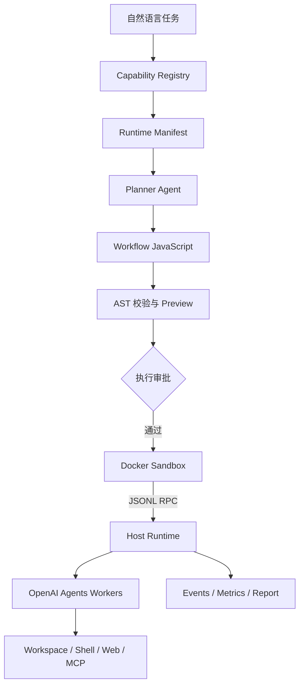
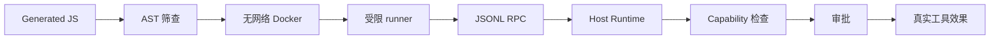

# Dynamic Workflow 的 Runtime 视角：把模型计划变成受控程序

<p class="article-meta">发布于 2026-07-17</p>

> 模型负责生成计划，Runtime 负责守住执行边界：权限、预算、记录和失败处理。

让模型参与生成或选择任务结构，并不是 Claude Code 独有的新想法。Graph runtime、workflow engine、orchestrator-workers 和多 Agent 编排都在处理相近的问题：复杂任务里的控制流不应该完全挤在一段对话上下文中。

Claude Code Dynamic Workflows 的特点，是把这个方向做成了清晰的产品形态：Claude 可以先生成一段 JavaScript workflow script，再交给后台 Runtime 执行。脚本负责协调上下文隔离的 subagent，中间状态保存在程序变量和运行时事件里，而不是不断回填到主上下文。

从 Runtime 视角看，更具体的问题是：模型生成了 workflow 之后，系统怎样限制它能看见什么、调用什么、消耗多少预算，以及失败后留下哪些事实？

换句话说，Dynamic Workflow 的关键不是“模型能不能写流程”，而是**模型写出的流程怎样被收束成一个受限、可审计、可被拒绝执行的普通程序**。为避免把不同层次混在一起，下文会区分三件事：

- **产品化案例**：Claude Code Dynamic Workflows 把任务专用 harness 做成开发者可直接使用的能力。
- **本地最小原型**：第 3 到第 6 节基于仓库内 `experiments/dynamic-workflow/` 的原型，讨论 `@openai/agents`、Chat Completions provider、Docker sandbox 和 JSONL RPC 组合下需要补齐的 Runtime 语义。
- **核心观点**：Generated workflow 的可信度主要来自 Runtime 语义，而不是 Planner 本身。

## 1. 从对话编排到程序编排

传统 Agent loop 看起来只有模型和工具：

```text
model -> tool -> model -> tool -> final answer
```

这个循环在短任务里很顺手，但长任务会把四种职责压进同一个上下文：

| 职责 | 单 loop 中的表现 | 长任务中的问题 |
| --- | --- | --- |
| 研究者 | 阅读文件、理解目标、形成结论 | 上下文被过程塞满，最终报告缺证据 |
| 工作记忆 | 记住读过什么、验证过什么 | 聊天历史不是执行数据库 |
| 调度器 | 决定下一步、并发、重试、停止 | 停止条件和预算容易漂移 |
| 安全策略 | 判断能否执行命令或写文件 | 权限和副作用被混在自然语言里 |

Dynamic Workflow 的关键取舍，是把其中一部分职责移出对话：先形成一段 workflow code，再由 Runtime 执行这段 code。Claude Code 官方文档把这个差异概括为：workflow 把计划移进代码。

这不是简单地启动更多 subagent。Subagent、skills、agent teams 和 workflows 都能做多步任务，差异在于谁持有计划：

| 结构 | 谁决定下一步 | 中间结果在哪里 | 可复用的是什么 |
| --- | --- | --- | --- |
| Subagent | 主模型逐轮决定 | 主上下文或子上下文摘要 | worker 定义 |
| Skill | 模型按说明执行 | 主上下文 | 操作说明 |
| Agent team | lead agent 逐轮协调 | 团队任务状态 | 团队配置 |
| Dynamic workflow | 脚本和 Runtime 执行 | 脚本变量与运行时状态 | 本次编排程序 |

所以它的产品意义不是“并发更多”，而是：**orchestration 从概率性对话转移到由程序承载的执行边界里**。

## 2. 这不只是多 Agent，而是把编排语义落到程序里

要理解 workflow script，先要定义“workflow 原语”。原语不是把 JavaScript 的 `if`、`for...of`、变量和 `return` 重新包装一遍；这些确定性控制流由语言本身表达即可。只有当某个动作需要 Runtime 参与调度、计数、授权、隔离或观察时，它才值得成为原语。

本地最小原型选择了六个原语。不同产品可以裁剪或合并这些接口，但推导逻辑相同：从 Runtime 必须看见的执行边界反推。

| 执行边界 | Runtime 必须接管什么 | 原语 |
| --- | --- | --- |
| 启动一段隔离的模型工作 | worker 上下文、capability 选择、调用计数、超时、结构化结果 | `agent(prompt, opts?)` |
| 同时启动一组独立工作 | 懒启动、并发上限、barrier、事件归属 | `parallel(thunks)` |
| 让动态工作集经过多阶段处理 | item 级流动、阶段结果传递、避免全局等待 | `pipeline(items, ...stages)` |
| 复用已保存的子流程 | workflow registry、父子关系、共享预算、嵌套深度 | `workflow(nameOrRef, args?)` |
| 标记执行阶段 | 进度分组、事件归类、UI 展示 | `phase(title)` |
| 输出受限进度事件 | 日志大小限制、事件流归档、避免任意控制台输出 | `log(message)` |

按这个推导，`agent()` 是“模型工作边界”，`parallel()` 和 `pipeline()` 是“调度边界”，`workflow()` 是“组合复用边界”，`phase()` 和 `log()` 是“可观测性边界”。这些边界如果只留在普通 JS 代码里，Runtime 就很难统一计数、限流、审批和记录。

有了这些原语，一个最小 workflow script 大概长这样：

```javascript
export const meta = {
  name: 'audit-routes',
  description: 'Audit route handlers for missing auth checks',
}

const found = await agent('List every .ts file under src/routes/.', {
  schema: {
    type: 'object',
    required: ['files'],
    properties: { files: { type: 'array', items: { type: 'string' } } },
  },
})

const audits = await pipeline(found.files, file =>
  agent(`Audit ${file} for missing authentication checks.`, { label: file }),
)

return audits.filter(Boolean)
```

这段代码里有两层动态性：

- **生成时动态**：模型为当前任务决定要先发现文件，再按文件展开审计。
- **运行时动态**：`found.files` 的长度决定实际启动多少 worker。

但进入执行阶段后，它又不是自由对话循环。`pipeline()` 何时启动下一阶段、`agent()` 的结果如何回到脚本变量、最终 `return` 什么，都已经变成程序语义。模型不再每一步都重新决定“是否还要继续探索”。

以并发启动语义为例，如果 Runtime 要接管任务启动时机，`parallel()` 就更适合接收 thunk，而不是已经启动的 Promise：

```javascript
const [security, correctness] = await parallel([
  () => agent('Review security risks'),
  () => agent('Review correctness risks'),
])
```

Thunk 让 Runtime 掌握任务启动时机、并发计数和事件归属。否则任务可能在 Runtime 接管前就开始，编排代码看起来可控，实际工具调用已经发生。

这一步把“多 Agent”提升成了“控制程序”。但只要程序是模型生成的，新的问题立刻出现：它能看到什么、能调用什么、错误如何记录、越权时如何被拒绝？

## 3. 最小原型：Runtime Manifest 是 Planner 的边界

本地最小原型的入口只有两个：

```text
/plan <description>      只生成、校验和预览
/workflow <description>  生成、审批并执行
```

完整链路是：



这个链路里，Planner prompt 并不复杂。它只是告诉模型：

- 可用全局函数只有 `agent`、`parallel`、`pipeline`、`workflow`、`phase`、`log`；
- 脚本可以使用普通 JavaScript 控制流；
- `capabilities` 必须来自 runtime manifest，不能编造；
- 如果缺少必要能力，应在 workflow 里报告限制，而不是假装能访问；
- 需要返回一个 JSON-serializable 的结果。

这说明 Planner 本身不是边界。边界来自它收到的 `Runtime Manifest`：

| Manifest 字段 | 作用 |
| --- | --- |
| primitives | 告诉 Planner 只有哪些 workflow 原语可用 |
| capabilities | 暴露 capability ID、风险等级和 host tool 名称 |
| savedWorkflows | 允许调用哪些已保存子 workflow |
| workspaceRoot | 说明当前工作区，避免暗示任意文件系统访问 |
| limits | 暴露 agent 次数、并发、嵌套、脚本和输出大小限制 |
| provider | 明确这是 Chat Completions runtime，不支持 hosted tools、tool search、defer loading |

换句话说，Manifest 不是说明性文档，而是 Planner 的现实边界。一个 dynamic workflow runtime 的核心设计问题，是如何把“当前可用能力”序列化成模型能理解、但不能突破的事实。

这也是 `/plan` 的价值：它只生成、校验并保存脚本，不构造 worker agent，也不启动 Docker。它把“模型打算怎么做”暴露出来，让执行前的审查成为可能。

## 4. 最小原型：Workflow JS 是不可信控制程序

模型生成 JavaScript 以后，不能因为它长得像代码就默认可信。这个原型的校验层会拒绝：

- `import`、`export default`、`require`、`process`、`globalThis`、`fetch`；
- `eval`、`Function`、`new Function`；
- `__proto__`、`constructor`、`prototype` 等属性访问；
- `while`、`do...while` 和无条件 `for(;;)`；
- 超过大小限制的脚本。

但 AST 黑名单不能构成安全保证。更诚实地说，脚本最终仍然会在 sandbox runner 里被包进一个函数执行。安全性来自多层约束叠加，而不是某一层完美：



本地 sandbox 的边界是：

- 容器无网络；
- 只读文件系统；
- 非特权用户；
- CPU、内存和进程数限制；
- 不注入宿主凭据；
- 脚本只通过 stdout/stdin 的 JSONL RPC 请求 host。

因此 workflow 程序本身不能读仓库、不能跑 shell、不能访问网络、不能拿到模型凭据。它只能发出类似这样的 RPC 请求：

```json
{"id":1,"method":"agent","params":{"prompt":"Audit src/auth.ts","options":{"capabilities":["workspace.read"]}}}
```

实际的文件读取、Shell、Web、MCP 调用都发生在宿主侧 worker 中，再经过 capability 和权限检查。这里的分层很关键：**sandbox 隔离的是生成的控制程序，worker 隔离的是 Agent 上下文；它们不是同一种隔离。**

## 5. 最小原型：Capability Registry 才是权限事实来源

如果把工具直接交给 Planner，模型可能把“想做什么”混淆成“有权做什么”。这个原型反过来做：先由配置和环境构造 `Capability Registry`，再把 registry 的 manifest 交给 Planner。

内置 capability 包括：

| Capability | Host-side tool 语义 |
| --- | --- |
| `workspace.read` | 在配置的 workspace root 内 list、read、literal search |
| `workspace.write` | 受限创建文件和 exact-text replacement |
| `shell.exec` | 不经过 shell 执行 allowlist 内的 command + args |
| `web.fetch` | HTTP(S) GET，域名 allowlist，redirect 重新校验 |
| `web.search` | 通过配置的 server-side adapter 搜索 |
| `mcp.<id>` | 过滤后的 MCP tool，转换成 Chat Completions function tool |

每个 worker 只能显式选择 registry 中存在的 capability：

```javascript
const result = await agent('Inspect package and test structure.', {
  label: 'repository-reader',
  capabilities: ['workspace.read'],
})
```

这里有几个细节比“工具权限”这个词更重要：

- 省略 `capabilities` 默认只有 `workspace.read`；
- 传 `[]` 表示 reasoning-only worker；
- 引用不存在或连接失败的 capability 会失败即拒绝；
- MCP stdio 启动本身是 `exec` action，HTTP MCP 启动本身是 `network` action；
- 高风险 action 需要先通过路径、域名、命令等边界检查，再通过 TTY 审批或 `--yes`；
- 并发 worker 的审批会串行化，避免多个 approval prompt 交错出现。

因此更准确的不变量不是“子 workflow 继承父 workflow 的工具”，而是：

```text
成功加载的项目能力
⊇ shared runtime registry
⊇ 每个 worker 显式选择的能力
```

父子 workflow 共享 registry、权限上下文、agent 并发队列和调用预算。父 workflow 选择 `workspace.read` 不代表子 workflow 自动被限制到这个集合；每个 worker 都在 shared registry 内独立声明自己需要的能力，但不能超出本次运行的全局上限。

这比“让模型按 prompt 自觉少用工具”可靠得多，因为权限事实存在于 host runtime，而不是模型的自我约束里。

## 6. 最小原型暴露的边界：Provider 兼容、失败语义和 Durable

在 OpenAI-compatible runtime 中实现类似形态时，会遇到一批产品介绍通常不会展开的边界。

第一，Chat Completions 兼容不等于所有 Agent 能力都可用。这个原型使用 `@openai/agents`，但 provider 固定为 Chat Completions 模式，并显式拒绝 Responses-only 能力：

```text
unsupported:
  hosted-web-search
  hosted-shell
  hosted-mcp
  tool-search
  deferLoading
```

这迫使 Web、Shell、MCP 都在本地实现为 function tools。好处是能力边界清楚；代价是不能直接复用 hosted tool 的语义。

第二，`tools + json_schema` 组合在 OpenAI-compatible 网关上不一定可靠。实验中 provider 可以分别支持 tool calling 和 structured output，但组合起来不一定稳定。因此 worker 的结构化输出采用三段 fallback：

1. 有工具的 worker 先返回文本；
2. 本地尝试从文本中 parse 和 validate JSON；
3. 失败时再调用无工具 formatter 做 JSON repair。

这不是理想路径，而是兼容层的现实约束。它也提醒我们：Workflow Runtime 的预算不能只数 `agent()` RPC。Planner 调用、formatter 修复、超时后仍在底层继续跑的模型请求，都可能产生额外成本。

第三，运行归档不是 durable execution。当前原型会保存：

```text
.workflow/runs/<run-id>/
  request.json
  manifest.json
  workflow.generated.js
  permissions.json
  status.json
  events.jsonl      # 成功执行后
  metrics.json      # 成功执行后
  report.json       # 成功执行后
```

成功运行可以回答启动了多少 worker、经过哪些 phase、耗时多少、暴露了哪些 capability。失败运行目前只能可靠回答请求是什么、Planner 看到了什么 manifest、生成了什么脚本、哪些权限被批准或拒绝、最终错误是什么。

这不等于 checkpoint。它不能从任意 Agent 边界跨进程继续，也没有完整记录所有只读工具的参数和结果。Dynamic 和 durable 是两条轴：

| 维度 | 讨论的问题 |
| --- | --- |
| Dynamic | 任务结构何时形成，由谁形成 |
| Durable | 进程、worker 或机器失败后能否恢复 |

一个 workflow 可以高度动态，却只能活在当前进程；也可以完全固定，却能跨数月等待、重放和恢复。不要用“动态”替代 checkpoint、幂等、取消、重试和恢复语义。

第四，安全边界必须诚实描述。当前原型仍有缺口：

- AST 黑名单可能漏掉动态属性组合；
- `shell.exec` 只限制命令名，解释器参数仍危险；
- 宿主命令当前继承环境变量，不适合不可信任务；
- agent timeout 返回错误后，没有实际取消底层模型请求；
- 没有 token、费用和 provider 级速率预算；
- Docker 本机容器不是生产级多租户隔离。

这些不是附带免责声明，而是 Dynamic Workflow 的核心经验：模型生成越灵活，Runtime 越要保守。

## 实现观察附录

这个原型的实验目标不是比较 Claude Code、LangGraph 或 Temporal，而是验证一组工程假设。

早期只读 fixture 实验验证了 GLM provider、Docker sandbox、动态 fan-out、saved child workflow 和 JSONL RPC：一次审计发起 7 次 agent 调用，并识别了刻意植入的缺少 admin 授权缺陷；嵌套实验执行 6 次 agent 调用和 3 次 child workflow 调用，父子 phase、log、并发和总预算汇入同一事件流。

通用化重构后，自动测试扩展到 33 项，覆盖：

- invocation parser 和 `/plan` service；
- `.workflow/runs` 产物；
- REPL；
- AST 规则；
- JSONL RPC；
- `parallel` barrier；
- `pipeline` streaming；
- 父子预算；
- 读写路径隔离；
- shell allowlist；
- Web redirect 和 size limit；
- 审批串行化；
- MCP list、filter、call、close。

这些测试验证的是 Runtime 契约，不是安全保证，也不是 Agent 质量评测。

这个原型默认限制为 32 次 `agent()` RPC、4 路 workflow 并发、32 次子 workflow 调用和 1 层嵌套，并限制脚本、prompt、输出和日志大小。这些限制能阻止 workflow 层面的失控，但不能替代 provider 级 token、费用和速率控制。

## 什么时候值得使用 Dynamic Workflow

选择标准不是“要不要多 Agent”，而是**哪一部分不确定**：

| 不确定性 | 更合适的结构 |
| --- | --- |
| 步骤固定 | Chain 或普通代码 |
| 节点已知，只是路径不同 | 条件 Graph |
| 只是不知道工作项数量 | Data-driven fan-out |
| 拆分策略、依赖和验证方法也随任务变化 | Generated Dynamic Workflow |
| 需要跨进程、跨部署或长期等待 | 叠加 Durable Runtime |

Dynamic Workflow 不是 Agent 系统的默认终点。它只在任务结构本身具有足够不确定性时，才值得引入额外复杂度。

当这种不确定性确实存在时，它提供的平衡是：

- 模型负责理解目标、形成任务结构和判断证据；
- Workflow code 保存这次任务的计划和中间结果；
- Runtime 负责 manifest、capability、sandbox、RPC、权限、预算、失败和观察。

> **全文结论：** Dynamic Workflow 的核心不是让 Agent 更自由，而是把模型的自由放进一个更窄、更可审计、失败也更容易解释的程序边界里。

## 参考资料

- [Orchestrate subagents at scale with dynamic workflows - Claude Code Docs](https://code.claude.com/docs/en/workflows)
- [Agent SDK reference - TypeScript](https://code.claude.com/docs/en/agent-sdk/typescript)
- [Introducing Dynamic workflows in Claude Code](https://claude.com/blog/introducing-dynamic-workflows-in-claude-code)
- [A harness for every task: dynamic workflows in Claude Code](https://claude.com/blog/a-harness-for-every-task-dynamic-workflows-in-claude-code)
- [Building effective agents - Anthropic](https://www.anthropic.com/engineering/building-effective-agents)
- [Effective context engineering for AI agents - Anthropic](https://www.anthropic.com/engineering/effective-context-engineering-for-ai-agents)
- [OpenAI Agents SDK](https://openai.github.io/openai-agents-js/)
- [Sessions - OpenAI Agents SDK](https://openai.github.io/openai-agents-js/guides/sessions/)
- [Workflow agents - Google ADK](https://google.github.io/adk-docs/agents/workflow-agents/)
- [Dynamic workflows - Google ADK](https://google.github.io/adk-docs/workflows/dynamic/)
- [GraphFlow Workflows - AutoGen](https://microsoft.github.io/autogen/stable/user-guide/agentchat-user-guide/graph-flow.html)
- [LangGraph overview](https://docs.langchain.com/oss/python/langgraph/overview)
- [LangGraph persistence](https://docs.langchain.com/oss/python/langgraph/persistence)
- [What is Durable Execution? - Temporal](https://temporal.io/blog/what-is-durable-execution)
- [Activity Definition - Temporal](https://docs.temporal.io/activity-definition)
