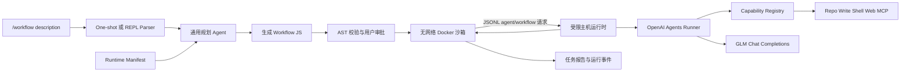

# Dynamic Workflow 原理与 MVP

这篇文章从第一性原理出发理解 AI agent dynamic workflow，并用 `@openai/agents` 与一个 OpenAI-compatible GLM 网关实现最小原型。目标不是复刻 Claude Code 的完整产品，而是把它背后的工程原理拆开：什么时候需要动态工作流，动态性到底来自哪里，运行时必须守住哪些边界。

## 一句话结论

Dynamic workflow 是一种把“概率性的 agent 工作”放进“确定性的控制程序”里运行的 harness。模型可以参与生成这段控制程序，但一旦程序进入运行时，循环、分支、并发、预算、验证、停止条件和状态聚合都应该由代码承担。

Claude Code 的 Dynamic workflows 给了一个清晰样板：Claude 针对任务生成 JavaScript 脚本，运行时提供六个受控原语，脚本协调大量隔离子代理，最终只把压缩后的结果带回主会话。这个模式的价值不只是“并行更多 agent”，而是把上下文、状态、失败恢复和质量门槛从主对话里移到可读、可保存、可重放的代码里。

## 从第一性原理看 Agent Workflow

一个 agent 系统至少有四个层次：

1. 模型：负责理解、推理、生成计划和文本。
2. 工具：负责把模型意图变成环境动作，并返回地面事实。
3. 状态：记录已经发生了什么、下一步需要什么、哪些证据可信。
4. 控制流：决定何时调用模型、工具或人，以及何时停止。

很多早期 agent demo 把这四层都塞进一个对话循环。模型一边记上下文，一边计划，一边调用工具，一边判断是否结束。这个方式简单，但在长任务中会遇到复合失败：

- 上下文窗口被中间过程挤满，最终答案反而缺少关键信息。
- 单个模型上下文会自我强化，早期错误假设难以被独立反驳。
- 并发和预算不透明，任务规模稍大就变成不可控的 token 消耗。
- 状态只存在于聊天历史中，失败后很难精确恢复。
- 工作流程不可复用，下一次相似任务仍要靠自然语言重新组织。

因此 workflow 的第一性原理不是“画一个图”，而是把控制流和状态显式化。模型仍然重要，但它不应该独占 orchestration。

## 动态性到底是什么

“动态 workflow”容易被误解成模型在每一步都自由改写流程。更准确的拆分是：

- 静态模板：人预先定义步骤，例如 sequential、parallel、loop。
- 静态图：人预先定义节点和边，运行时按条件走不同路径。
- 动态路由：运行时根据中间结果选择 agent、工具或分支。
- 动态拓扑：运行时先发现工作集，再生成后续节点，例如先找出 500 个文件，再为每个文件启动审计 agent。
- 动态生成 harness：模型针对当前任务生成一段可执行编排代码，然后由运行时执行。

Claude Code 的 Dynamic workflows 处在最后两层：模型生成 JavaScript harness，脚本可以用普通控制流表达循环、分支、数组处理和并行 fan-out。生成之后，下一步由脚本和 runtime 决定，而不是主会话里的 Claude 逐轮临场协调。

这点很关键：动态 workflow 的可信度来自“生成时灵活，执行时受控”。

## Claude Code Dynamic Workflows 的机制

官方名称是 **Dynamic workflows**，不是 `dynamic-workflows@workflow`。Claude Code 文档描述的核心机制如下：

- Claude 根据任务写出 JavaScript workflow script。
- 脚本在独立 runtime 中后台执行，主会话保持可响应。
- 脚本不能直接访问文件系统或 shell，只能协调子代理。
- 六个脚本原语分别负责单 agent、并行屏障、流式流水线、嵌套 saved workflow、进度分组和 narrator 日志。
- 中间结果保存在脚本变量中，而不是塞回主对话上下文。
- 运行时管理进度、暂停、恢复、并发和成本边界。
- 官方限制包括最多 16 个并发 agent、每次运行最多 1,000 个 agent，恢复只保证在同一 Claude Code session 内有效。

一个简化脚本长这样：

```javascript
export const meta = {
  name: 'audit-routes',
  description: 'Audit route handlers for missing auth checks',
}

const found = await agent('List every .ts file under src/routes/.', {
  schema: {
    type: 'object',
    required: ['files'],
    properties: { files: { type: 'array', items: { type: 'string' } } },
  },
})

const audits = await pipeline(found.files, file =>
  agent(`Audit ${file} for missing authentication checks.`, { label: file }),
)

return audits.filter(Boolean)
```

这段代码体现了 Dynamic Workflow 的三个要点：

- 发现阶段决定后续 fan-out 的规模，拓扑不是预先固定的。
- 每个文件的审计发生在隔离子代理中，避免一个上下文吞下全部文件。
- 脚本变量保留中间状态，最终只输出筛选后的结果。

## 六个最小 Workflow 原语

本文 MVP 将公开执行面收敛为与 Claude Code 对齐的六个原语：

- `agent(prompt, opts?)`：启动单个隔离子代理，返回最终文本或 schema 校验后的 JSON。
- `parallel(thunks)`：并发启动一组零参数任务函数，在明确的同步屏障处返回有序结果。
- `pipeline(items, ...stages)`：每个 item 依次流过所有 stage；不同 item 可独立前进，不存在 stage 级全局 barrier。
- `workflow(nameOrRef, args?)`：从 allowlisted registry 调用 saved workflow，作为子步骤返回结果；当前只允许一层嵌套。
- `phase(title)`：命名当前监控进度组，不包裹函数、不改变控制流。
- `log(msg)`：向事件流输出有长度限制的 narrator line。

这里不把普通 `if`、`for...of`、变量、函数和 `return` 重复包装成 workflow DSL；JavaScript 已经能表达确定性控制流。原语只覆盖需要 runtime 参与的边界：agent 调度、并发/流式语义、组合复用和可观测性。

`parallel` 接收 thunk 而不是已经启动的 Promise，是为了让 runtime 掌握任务启动时机：

```javascript
const [security, correctness] = await parallel([
  () => agent('Review security risks'),
  () => agent('Review correctness risks'),
])
```

## 和常见 Agent 编排的区别

`@openai/agents` 提供了 Agent、Runner、tools、handoffs、agents-as-tools、guardrails、sessions 和 tracing。这些原语解决的是“单次 run 内怎样可靠地执行 agent loop 和多 agent 协作”。

Dynamic workflow 则站在更外层：

- Handoff 适合“某个 specialist 接管这次回复”。
- Agents-as-tools 适合“manager agent 调用 specialist 并保持最终回答权”。
- Deterministic manager 适合“工程师写死流程，模型填充每一步”。
- Dynamic workflow 适合“先让模型为本次任务生成控制程序，再由运行时执行和约束它”。

这不是替代关系。本文 MVP 用 `@openai/agents` 作为子代理执行层，用一个自建 workflow runtime 作为外层控制层。

## 发展趋势

Agent workflow 的趋势可以归纳为几条线：

- 从 prompt 链到 harness：可靠性越来越依赖运行时，而不是更长的系统提示。
- 从共享上下文到隔离上下文：主 agent 保持目标和摘要，子 agent 在独立上下文里深挖局部问题。
- 从静态模板到动态拓扑：sequential、parallel、loop 仍然有用，但复杂任务需要运行时先发现工作集。
- 从自由自治到受限自治：模型可以生成计划或代码，但文件、网络、shell、凭据和预算必须由宿主控制。
- 从“跑完就行”到 durable execution：生产系统需要 checkpoint、retry、human-in-the-loop、审计日志和跨进程恢复。
- 从单模型到多模型路由：不同步骤需要不同成本、速度、上下文长度和工具权限。
- 从结果评估到过程评估：trace、事件、结构化输出和 verifier agent 让质量问题更早暴露。

LangGraph、AutoGen GraphFlow、Google ADK 和 Temporal 分别代表了不同侧重点：图状态、团队编排、模板/自定义 workflow、durable execution。Claude Code Dynamic workflows 的独特之处是把“生成专用 harness”产品化。

## 本文 MVP

MVP 位于 `workflow/mvp`。它不再是固定的代码审计器，而是以 `/workflow <description>` 为唯一任务入口的通用 runtime：

1. one-shot 或 REPL parser 把自然语言 description 交给统一 service。
2. service 构造 runtime manifest：六原语、当前 capability、saved workflow、预算和 provider 限制。
3. 通用 planner 生成受约束的 JavaScript workflow，主机执行 AST 校验、preview 和审批。
4. 脚本在无网络、只读、降权 Docker 沙箱中运行。
5. 沙箱通过 JSONL RPC 请求主机执行 `agent()` 或 saved `workflow()`；`phase()` 和 `log()` 产生可观测事件。
6. 通用 worker 只获得 `opts.capabilities` 指定的 host tools；父子 workflow 共享 registry、权限与预算。
7. 运行产物写入 `.workflow/runs/<run-id>/`，saved workflows 位于 `.workflow/workflows/`。



这个 MVP 刻意保守：

- 不允许 workflow 脚本直接读仓库。
- 不允许脚本访问网络、环境变量、shell 或模型凭据。
- 高风险能力只以 host function tool 或 filtered MCP tool 暴露，先经过配置 allowlist 和 containment，再经过 TTY 或 `--yes` 审批。
- 未声明 capability 的 agent 默认只有 `workspace.read`；显式传 `[]` 时只做推理。
- saved workflow 最多嵌套一层，父子调用共享 agent 总预算与并发限制。
- 不宣称跨进程 durable resume。
- 不使用 Responses-only hosted web/shell/MCP、tool search、Conversations 或 OpenAI tracing exporter。

## 实验设计

推荐实验分三步：

1. 在 REPL 中运行 `/doctor`，验证 GLM 网关是否支持纯文本、单工具调用和结构化 JSON。
2. 用 `/plan <description>` 只生成、校验并保存 workflow，不执行 agent fan-out。
3. 用 `/workflow <description>` 分别验证仓库研究、Web、Shell、写入和 MCP；观察 planner 是否只引用 manifest 中存在的 capability。

成功标准不是“发现所有 bug”，而是验证动态 workflow 的工程假设：

- 规划 agent 能生成可校验的有限脚本。
- runtime 能阻止越权脚本。
- 动态 fan-out 由发现结果驱动，而不是写死文件列表。
- 子代理只返回结构化结论，主上下文不承载全量中间过程。
- 失败、超时、预算耗尽能被清晰记录。

## 实验结果

早期只读 fixture 实验已验证 GLM provider、Docker 沙箱、动态 fan-out、saved child workflow 和 JSONL RPC：一次审计发起 7 次 agent 调用并识别了刻意植入的缺少 admin 授权缺陷；嵌套实验执行 6 次 agent 调用和 3 次 child workflow 调用，父子 phase、log、并发和总预算汇入同一事件流。

通用化重构后，自动验证扩展为 33 个测试：slash/引号/非法入口拒绝、plan-only service、`.workflow/runs` 产物、REPL、AST、parallel barrier、pipeline streaming、父子预算、读写路径隔离、shell allowlist、Web redirect/size、审批串行化，以及 MCP list/filter/call/close。无凭据 interaction smoke 也验证了 `npm start` REPL 的启动和退出。

provider 实验仍保留一个重要结论：网关分别支持 tool calling 和 structured output，不代表 `tools + json_schema` 组合可靠。通用 worker 因此先让有工具的 agent 返回文本，再做本地 JSON repair；只有解析失败时才调用无工具 formatter。

## 边界与下一步

单机 MVP 与生产系统之间还有明显距离：

- 持久化：需要 checkpoint，而不只是保存最终文件。
- 恢复：需要在 agent 调用边界重放已完成结果。
- 可观测性：需要 trace/span、token/cost、失败分类和可视化拓扑。
- 多租户隔离：Docker 本机沙箱不是完整安全边界。
- 多模型路由：规划、审计、验证、总结可以用不同模型和预算。
- 产品集成：当前是 CLI/REPL 同构交互，还不是真正的 IDE slash-command 或 Claude Code monitoring dashboard。

但这个 MVP 足够说明核心原理：dynamic workflow 不是让 agent 更自由，而是把它的自由放进更明确的程序、边界和运行时里。

## 文件索引

- `references.md`: 一手资料与关键结论。
- `mvp/README.md`: 原型安装、运行与安全说明。
- `mvp/examples/descriptions/`: 仓库、Web、Shell、MCP 四类自然语言任务。
- `mvp/.workflow/workflows/verify-finding.workflow.js`: 可被 `workflow()` 调用的 saved workflow 示例。
